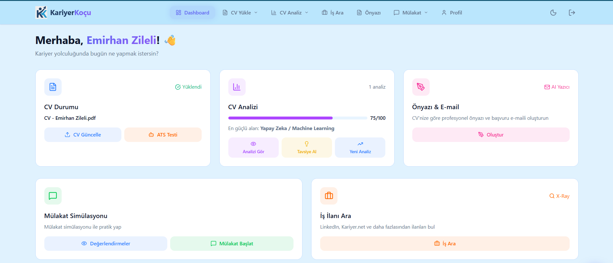
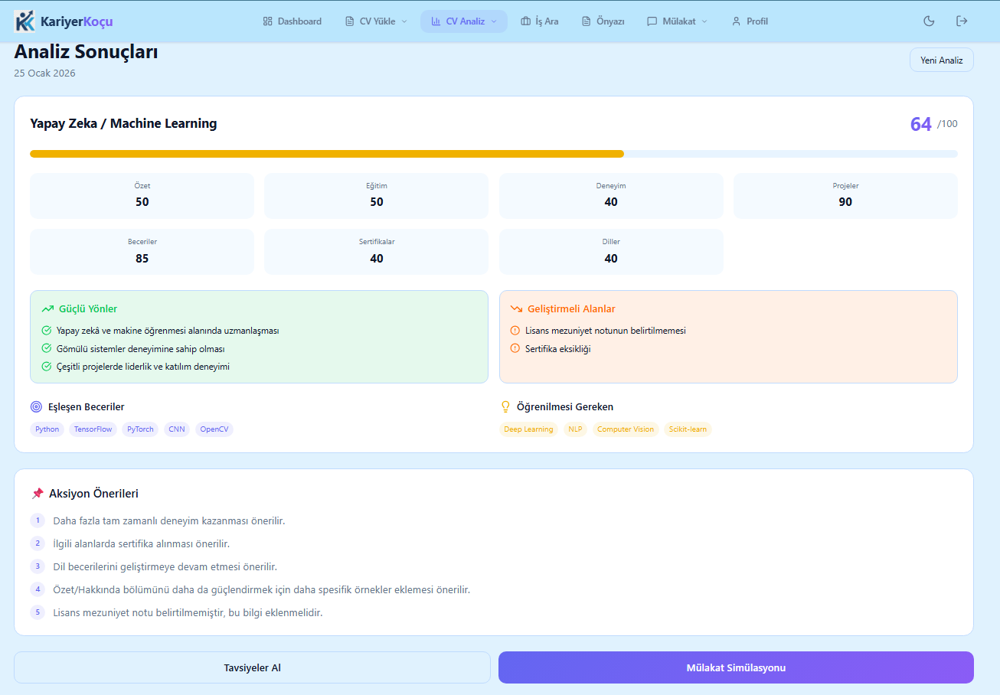
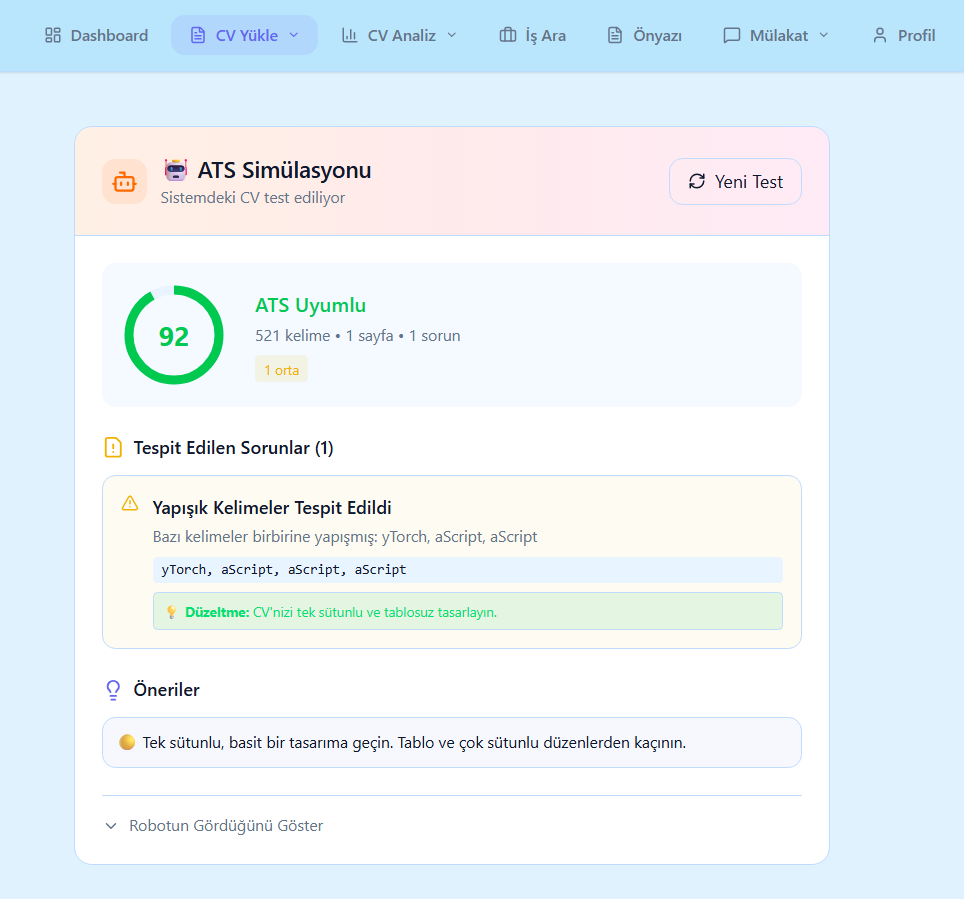
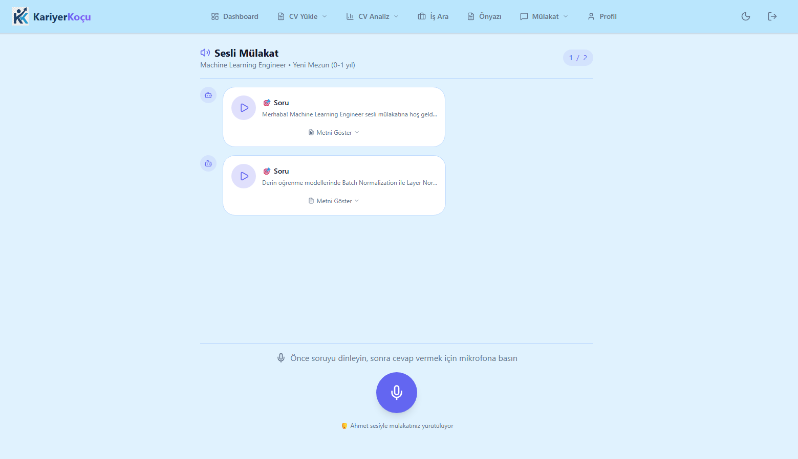
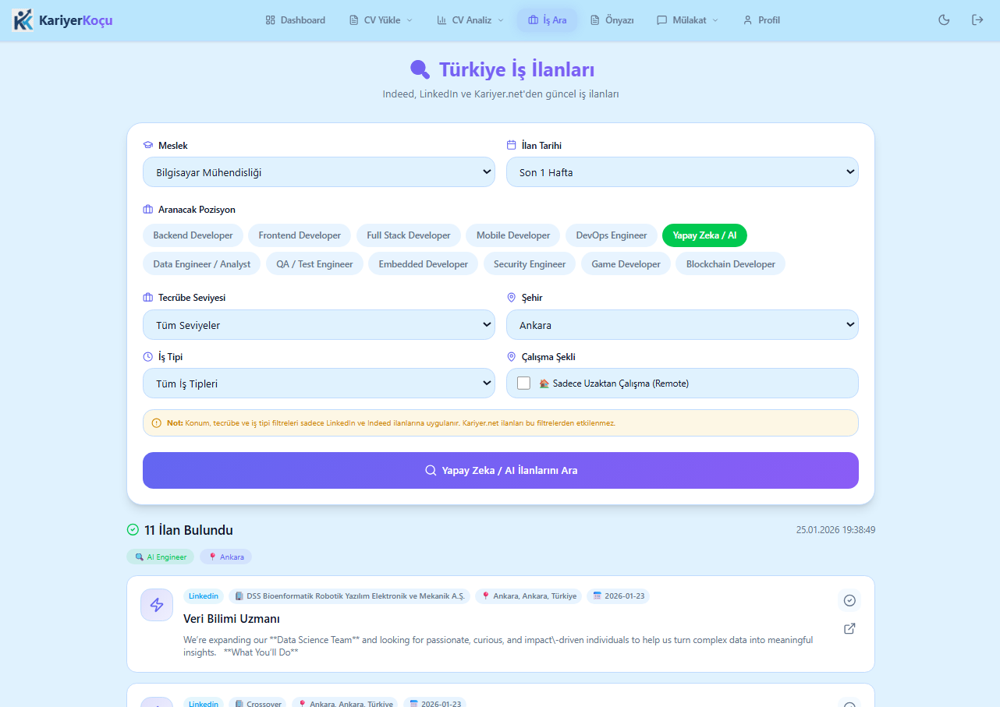
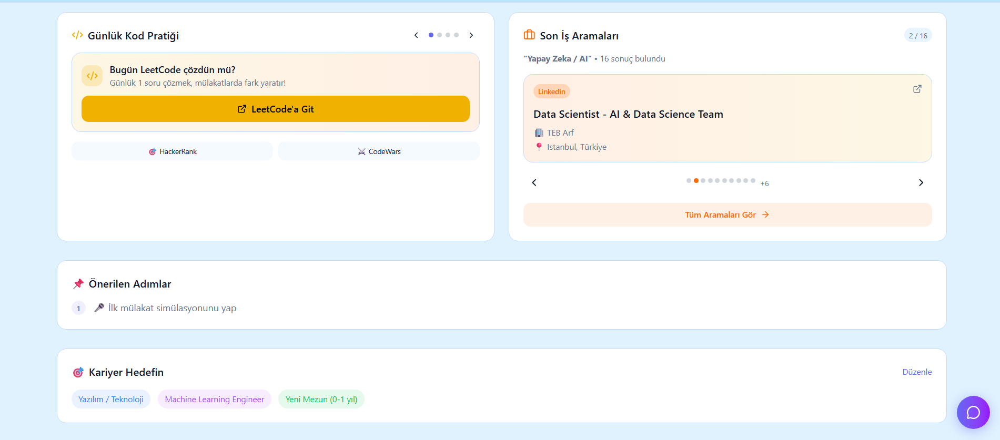
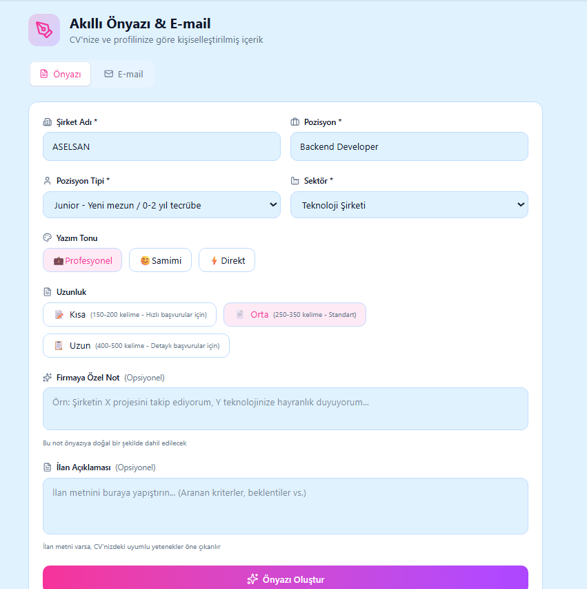
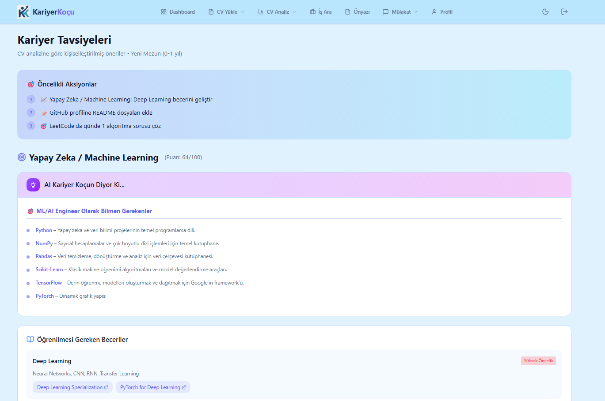

<p align="center">
  
  
  
  
  
  
  
</p>

<h1 align="center">🎯 KariyerKoçu</h1>

<h3 align="center">Yapay Zeka Destekli Kariyer Koçluk Platformu</h3>

<p align="center">
  <strong>CV Analizi • Mülakat Simülasyonu • İş Arama • Akıllı Kariyer Asistanı</strong>
</p>

---

## 📋 İçindekiler

- [Proje Hakkında](#-proje-hakkında)
- [io Intelligence Entegrasyonu](#-io-intelligence-entegrasyonu)
- [Özellikler](#-özellikler)
- [Ekran Görüntüleri](#-ekran-görüntüleri)
- [Sistem Mimarisi](#-sistem-mimarisi)
- [Kurulum](#-kurulum)
- [Kullanım](#-kullanım)
- [API Dokümantasyonu](#-api-dokümantasyonu)
- [Teknolojiler](#-teknolojiler)

---

## 🎯 Proje Hakkında

**KariyerKoçu**, iş arayanların kariyer yolculuğunda yapay zeka desteğiyle yanlarında olan kapsamlı bir platformdur. Kullanıcılar CV'lerini yükleyerek detaylı analiz alabilir, gerçekçi mülakat simülasyonları yapabilir, iş ilanları arayabilir ve kişiselleştirilmiş kariyer tavsiyeleri alabilir.

Platform, **io Intelligence** tarafından sağlanan güçlü LLM altyapısını kullanarak tüm yapay zeka işlemlerini gerçekleştirir. Bu sayede kullanıcılar, sektör standartlarına uygun, profesyonel düzeyde kariyer koçluğu hizmeti alabilmektedir.

### 🌟 Neden KariyerKoçu?

| Özellik                       | Açıklama                                              |
| ----------------------------- | ----------------------------------------------------- |
| **Kişiselleştirilmiş Analiz** | CV'niz hedef pozisyon ve sektöre göre değerlendirilir |
| **Gerçekçi Mülakat**          | Sesli veya yazılı mülakat simülasyonu yapın           |
| **Akıllı Eşleştirme**         | Becerileriniz ile iş ilanları karşılaştırılır         |
| **7/24 Asistan**              | AI chatbot ile istediğiniz zaman destek alın          |

---

## 🧠 io Intelligence Entegrasyonu

KariyerKoçu platformu, **io Intelligence** API'sini merkezi yapay zeka altyapısı olarak kullanmaktadır.

### Projede Nasıl Kullanılıyor?

io Intelligence, platformun tüm LLM (Large Language Model) işlemlerini yürütmektedir:

```
┌─────────────────────────────────────────────────────────────────┐
│                    KARİYERKOÇU PLATFORMU                        │
├─────────────────────────────────────────────────────────────────┤
│                                                                 │
│  ┌──────────────┐   ┌──────────────┐   ┌──────────────┐        │
│  │  CV Analizi  │   │   Mülakat    │   │   Chatbot    │        │
│  │   Servisi    │   │   Servisi    │   │   Servisi    │        │
│  └──────┬───────┘   └──────┬───────┘   └──────┬───────┘        │
│         │                  │                  │                 │
│         └──────────────────┼──────────────────┘                 │
│                            ▼                                    │
│              ┌─────────────────────────┐                        │
│              │      LLM Service        │                        │
│              │  (llm_service.py)       │                        │
│              └────────────┬────────────┘                        │
│                           │                                     │
└───────────────────────────┼─────────────────────────────────────┘
                            ▼
              ┌─────────────────────────┐
              │    io Intelligence      │
              │         API             │
              │  (Llama-3.3-70B-Instruct)│
              └─────────────────────────┘
```

### Sistem Mimarisindeki Rolü

| Modül                      | io Intelligence Kullanımı                                          |
| -------------------------- | ------------------------------------------------------------------ |
| **CV Analizi**             | CV içeriğini analiz eder, güçlü/zayıf yönleri belirler, puan verir |
| **ATS Simülasyonu**        | CV'nin ATS uyumluluğunu değerlendirir                              |
| **Mülakat Sorusu Üretimi** | Pozisyon ve seviyeye uygun sorular oluşturur                       |
| **Cevap Değerlendirme**    | Mülakat cevaplarını puanlar ve geri bildirim verir                 |
| **Skill Gap Analizi**      | Eksik becerileri tespit eder, öneriler sunar                       |
| **Ön Yazı Oluşturma**      | İş ilanına özel cover letter hazırlar                              |
| **Chatbot**                | Kariyer sorularına bağlamsal cevaplar verir                        |

### Projeye Sağladığı Katkılar

1. **Yüksek Kaliteli Yanıtlar**: Llama-3.3-70B modeli ile profesyonel düzeyde analiz ve öneriler
2. **Türkçe Dil Desteği**: Tam Türkçe yanıt üretimi ve anlama kapasitesi
3. **Düşük Gecikme**: Hızlı API yanıt süreleri ile akıcı kullanıcı deneyimi
4. **Ölçeklenebilirlik**: Çoklu kullanıcı taleplerini karşılayabilme
5. **OpenAI Uyumlu API**: Kolay entegrasyon ve geçiş imkanı

---

## ✨ Özellikler

### 📄 CV Analizi ve Yönetimi

- PDF/DOCX formatında CV yükleme
- Otomatik CV parse etme (beceriler, projeler, deneyim)
- 100 üzerinden puanlama sistemi
- Güçlü ve zayıf yön analizi
- ATS uyumluluk simülasyonu
- İyileştirme önerileri

### 🎤 Mülakat Simülasyonu

- **Metin Tabanlı Mülakat**: Yazarak cevap verin
- **Sesli Mülakat**: Mikrofonla konuşarak cevap verin
- Pozisyon ve deneyim seviyesine göre sorular
- Her cevap için detaylı puanlama (1-10)
- Mülakat sonrası kapsamlı rapor
- Mülakat geçmişi ve istatistikler

### 🔍 İş Arama ve Skill Gap

- Çoklu platform üzerinden iş ilanı arama
- Beceri eşleştirme analizi
- Eksik beceri tespiti
- Öğrenme kaynağı önerileri

### ✉️ Ön Yazı Oluşturma

- Seçilen iş ilanına özel ön yazı
- CV bilgilerinizle kişiselleştirme
- Profesyonel format

### 💬 Akıllı Kariyer Asistanı

- Bağlam-farkındalıklı chatbot
- CV ve analiz verilerinize erişim
- Kariyer tavsiyeleri
- 7/24 destek

---

## 📸 Ekran Görüntüleri

### 📊 Dashboard

Tüm kariyer verilerinizi tek bir panelden görüntüleyin.



### 📄 CV Analizi

CV'nizi yükleyin ve yapay zeka destekli detaylı analiz alın. Hedef sektör ve alan seçerek kişiselleştirilmiş analiz raporu oluşturun.



### 🤖 ATS Simülasyonu

CV'nizin ATS (Applicant Tracking System) robotları tarafından nasıl okunduğunu test edin.



### 🎤 Mülakat Simülasyonu

Gerçekçi mülakat deneyimi yaşayın. Sesli veya yazılı mülakat yapabilirsiniz.



### 🔍 İş Arama

Çeşitli platformlardan iş ilanlarını tek yerden arayın. LeetCode pratik önerileri ile kodlama becerilerinizi geliştirin.




### ✉️ Ön Yazı & E-mail Oluşturma

Seçilen iş ilanına özel profesyonel ön yazı ve başvuru e-maili oluşturun.



### 💡 Kişiselleştirilmiş Tavsiyeler

CV analizinize göre kariyer tavsiyeleri, öğrenme kaynakları ve proje önerileri alın.



---

## 🏗️ Sistem Mimarisi

```
┌─────────────────────────────────────────────────────────────────────────┐
│                              FRONTEND                                    │
│                     React 19 + TypeScript + Vite                        │
│                         TailwindCSS + Zustand                           │
│                              (Port 80)                                   │
└─────────────────────────────────┬───────────────────────────────────────┘
                                  │ HTTP/REST
                                  ▼
┌─────────────────────────────────────────────────────────────────────────┐
│                              BACKEND                                     │
│                     FastAPI + SQLAlchemy + Pydantic                     │
│                             (Port 8000)                                  │
├─────────────────────────────────────────────────────────────────────────┤
│  ┌─────────────┐ ┌─────────────┐ ┌─────────────┐ ┌─────────────┐       │
│  │   Routers   │ │   Services  │ │   Models    │ │   Schemas   │       │
│  │  (API)      │ │  (İş Mantığı)│ │  (DB)       │ │  (DTO)      │       │
│  └─────────────┘ └─────────────┘ └─────────────┘ └─────────────┘       │
└────────────┬───────────────┬────────────────────────────────────────────┘
             │               │
             ▼               ▼
┌────────────────────┐ ┌─────────────────────────────────────────────────┐
│    PostgreSQL      │ │              EXTERNAL SERVICES                   │
│    (Port 5435)     │ │  ┌─────────────┐ ┌─────────────┐ ┌───────────┐  │
│                    │ │  │io Intelligence│ │ Groq Whisper│ │ Edge-TTS │  │
│  • users           │ │  │   (LLM)     │ │   (STT)     │ │  (TTS)   │  │
│  • cvs             │ │  └─────────────┘ └─────────────┘ └───────────┘  │
│  • cv_analyses     │ │  ┌─────────────────────────────┐               │
│  • interviews      │ │  │    İş İlanı Arama Servisi   │               │
│  • interview_q     │ │  │    (Multi-Platform Search)  │               │
└────────────────────┘ │  └─────────────────────────────┘               │
                       └─────────────────────────────────────────────────┘
```

---

## 🚀 Kurulum

### Gereksinimler

- **Docker Desktop** (Windows/Mac) veya **Docker Engine** (Linux)
- **Git**

> ⚠️ **Not**: Proje Docker ile çalıştırılmak üzere yapılandırılmıştır. Manuel kurulum önerilmemektedir.

### Adım 1: Projeyi Klonlayın

```bash
git clone https://github.com/kullanici/kariyerkocu.git
cd kariyerkocu
```

### Adım 2: Environment Dosyasını Yapılandırın

Proje kök dizininde `.env` dosyası oluşturun:

```env
# io Intelligence API (Zorunlu)
IO_INTELLIGENCE_API_KEY=your_io_intelligence_api_key
IO_INTELLIGENCE_BASE_URL=https://api.intelligence.io.solutions/api/v1
IO_INTELLIGENCE_MODEL=meta-llama/Llama-3.3-70B-Instruct

# Groq API - Sesli Mülakat için (Zorunlu)
GROQ_API_KEY=your_groq_api_key

# Veritabanı
DATABASE_URL=postgresql://postgres:password@db:5432/karriyer_kocu

# JWT Ayarları
JWT_SECRET=your-super-secret-jwt-key-change-this
JWT_ALGORITHM=HS256
JWT_EXPIRE_MINUTES=60

# Debug Modu
DEBUG=True
```

### Adım 3: Docker ile Başlatın

```bash
# Tüm servisleri başlatın
docker-compose up -d

# Logları izleyin
docker-compose logs -f
```

Bu komut üç container başlatır:
| Container | Port | Açıklama |
|-----------|------|----------|
| `caco_frontend` | 80 | React Frontend |
| `caco_backend` | 8000 | FastAPI Backend |
| `caco_db` | 5435 | PostgreSQL |

### Adım 4: Veritabanını Hazırlayın

```bash
# Tabloları oluşturun
docker exec -it caco_backend python -c "from app.database import Base, engine; Base.metadata.create_all(bind=engine)"
```

### Adım 5: Sisteme Erişin

| Servis          | URL                        |
| --------------- | -------------------------- |
| 🌐 Frontend     | http://localhost           |
| 🔧 Backend API  | http://localhost:8000      |
| 📚 Swagger Docs | http://localhost:8000/docs |

---

## 📖 Kullanım

### 1️⃣ Kayıt ve Giriş

- Ana sayfada "Kayıt Ol" butonuna tıklayın
- E-posta ve şifre ile hesap oluşturun
- Giriş yapın

### 2️⃣ Profil Ayarları

- Sağ üstteki profil menüsünden "Profil" sayfasına gidin
- Hedef sektör, pozisyon ve deneyim seviyenizi belirleyin
- Bu bilgiler CV analizinde ve mülakatta kullanılır

### 3️⃣ CV Yükleme ve Analiz

- "CV Yükle" sayfasına gidin
- PDF veya DOCX formatında CV'nizi yükleyin
- "Analiz Et" butonuna tıklayın
- Detaylı analiz raporunu inceleyin

### 4️⃣ Mülakat Simülasyonu

- "Mülakat" sayfasına gidin
- Sektör, pozisyon ve soru sayısını seçin
- Metin veya sesli mülakat modunu seçin
- Soruları cevaplayın ve anında geri bildirim alın

### 5️⃣ İş Arama

- "İş Ara" sayfasına gidin
- Meslek ve konum bilgilerini girin
- Birden fazla platformdan gelen ilanları görüntüleyin
- "Skill Gap Analizi" ile eksik becerilerinizi öğrenin

---

## 📡 API Dokümantasyonu

Backend API'si Swagger UI ile dokümante edilmiştir. Sistemi başlattıktan sonra:

**http://localhost:8000/docs**

adresinden interaktif API dokümantasyonuna erişebilirsiniz.

### Ana Endpointler

| Endpoint                | Metod | Açıklama         |
| ----------------------- | ----- | ---------------- |
| `/api/auth/register`    | POST  | Kullanıcı kaydı  |
| `/api/auth/login`       | POST  | Giriş yapma      |
| `/api/cv/upload`        | POST  | CV yükleme       |
| `/api/analysis/analyze` | POST  | CV analizi       |
| `/api/interview/start`  | POST  | Mülakat başlatma |
| `/api/interview/answer` | POST  | Mülakat cevabı   |
| `/api/jobs/search`      | POST  | İş arama         |
| `/api/chat/message`     | POST  | Chatbot mesajı   |

---

## 🛠️ Teknolojiler

### Backend

| Teknoloji            | Kullanım Amacı                    |
| -------------------- | --------------------------------- |
| **FastAPI**          | Async REST API framework          |
| **SQLAlchemy**       | ORM ve veritabanı işlemleri       |
| **Pydantic**         | Veri validasyonu ve serialization |
| **PyMuPDF (fitz)**   | PDF okuma ve metin çıkarma        |
| **pdfminer.six**     | Alternatif PDF parsing            |
| **python-docx**      | DOCX dosyası okuma                |
| **httpx**            | Async HTTP client                 |
| **python-jose**      | JWT token yönetimi                |
| **edge-tts**         | Text-to-Speech (TTS)              |
| **passlib + bcrypt** | Şifre hashleme                    |

### Frontend

| Teknoloji          | Kullanım Amacı     |
| ------------------ | ------------------ |
| **React 19**       | UI framework       |
| **TypeScript**     | Tip güvenliği      |
| **Vite**           | Build tool         |
| **TailwindCSS**    | Styling            |
| **Zustand**        | State management   |
| **React Router**   | Routing            |
| **Axios**          | HTTP client        |
| **Lucide React**   | İkon kütüphanesi   |
| **React Markdown** | Markdown rendering |

### Harici Servisler

| Servis              | Kullanım Amacı                   |
| ------------------- | -------------------------------- |
| **io Intelligence** | LLM API (Llama-3.3-70B-Instruct) |
| **Groq Whisper**    | Speech-to-Text (Sesli mülakat)   |
| **Edge-TTS**        | Text-to-Speech (AI sesi)         |
| **İş Arama Modülü** | Çoklu platform iş ilanı arama    |

### Altyapı

| Teknoloji          | Kullanım Amacı                      |
| ------------------ | ----------------------------------- |
| **Docker**         | Containerization                    |
| **Docker Compose** | Multi-container orchestration       |
| **PostgreSQL 15**  | Veritabanı                          |
| **Nginx**          | Frontend web server & reverse proxy |

---

## 📁 Proje Yapısı

```
kariyerkocu/
├── docker-compose.yml          # Docker orchestration
├── .env                        # Environment variables
│
├── backend/
│   ├── Dockerfile
│   ├── requirements.txt
│   ├── create_tables.sql
│   └── app/
│       ├── main.py             # FastAPI entrypoint
│       ├── config.py           # Ayarlar
│       ├── database.py         # DB bağlantısı
│       ├── models/             # SQLAlchemy modelleri
│       ├── schemas/            # Pydantic şemaları
│       ├── routers/            # API endpointleri
│       ├── services/           # İş mantığı
│       │   ├── llm_service.py          # io Intelligence entegrasyonu
│       │   ├── cv_analysis_service.py  # CV analiz servisi
│       │   ├── interview_service.py    # Mülakat servisi
│       │   ├── chat_service.py         # Chatbot servisi
│       │   └── ...
│       ├── career/             # Kariyer config
│       └── utils/              # Yardımcı fonksiyonlar
│
└── frontend/
    ├── Dockerfile
    ├── package.json
    ├── vite.config.ts
    └── src/
        ├── App.tsx
        ├── main.tsx
        ├── components/         # UI bileşenleri
        ├── features/           # Sayfa modülleri
        ├── hooks/              # Custom hooks
        ├── lib/                # API ve utility
        ├── stores/             # Zustand stores
        └── types/              # TypeScript tipleri
```

---

## 👥 Ekip

Bu proje **io.net Hackathon 2025** için geliştirilmiştir.

---

## 📄 Lisans

Bu proje **Creative Commons Attribution-NonCommercial-ShareAlike 4.0 International (CC BY-NC-SA 4.0)** lisansı altında lisanslanmıştır.

Bu lisans şunlara izin verir:

- ✅ Projeyi indirip inceleyebilir ve deneyebilirsiniz
- ✅ Eğitim ve kişisel kullanım için kullanabilirsiniz
- ❌ Ticari amaçla kullanamazsınız
- 📝 Paylaşırsanız kaynak göstermeniz ve aynı lisansı kullanmanız zorunludur

Detaylar için [LICENSE](LICENSE) dosyasına bakınız.

---

<p align="center">
  <strong>🚀 io Intelligence ile Güçlendirilmiştir 🚀</strong>
</p>

<p align="center">
  <a href="https://io.net">io.net</a> • 
  <a href="https://intelligence.io.solutions">io Intelligence</a>
</p>
